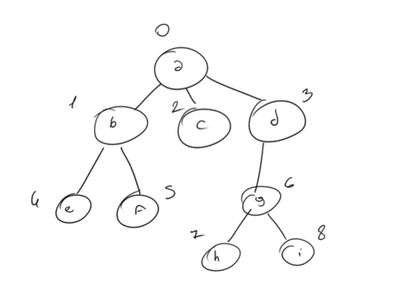
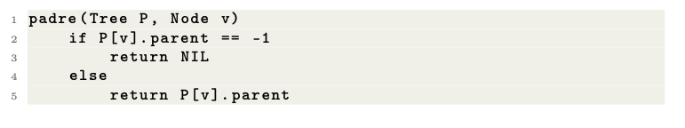
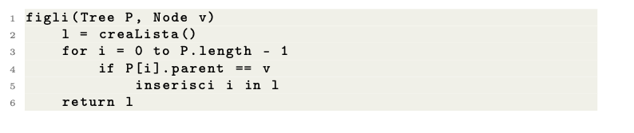

# Tree created using an Array

The implementation using an array requires a **vector of pairs** , where each node is represented **(info, parent)**. Where **info** is the information of the node and **parent** is the node's father.

The vector ***P*** associated is: 

## Observations

### 1) fatherTree

Return the Father of the Node

**Complexity : Θ(1)**

### 2) childrensTree

Returns a list of all children of node v

**Complexity : Θ(n)**
